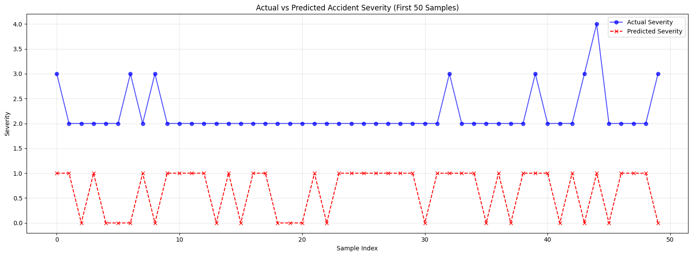
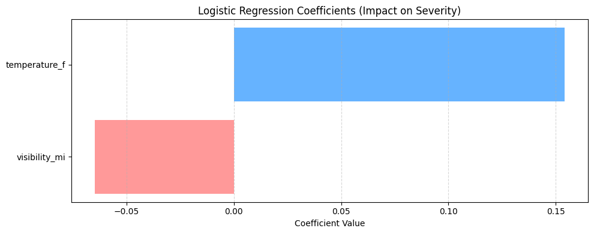

# 💡 Project Conclusions and Findings

## 🚧 The Challenge: Class Imbalance
The most significant hurdle in this dataset was severe class imbalance. Accident Severity Class 2 represented approximately **86.5%** of the data. 

When initially training Logistic Regression, XGBoost, and an Artificial Neural Network (ANN), all three models fell into the "accuracy trap." They achieved roughly 87% accuracy simply by predicting Class 2 for every single data point, resulting in a precision and recall of 0.00 for severities 1, 3, and 4.

## 🛠️ The Solution
To build a model that actually learns the underlying patterns, two primary techniques were implemented:

1. **SMOTE (Synthetic Minority Over-sampling Technique):** Applied before training the XGBoost model to synthetically generate new examples for the minority classes, balancing the distribution.
2. **Class Weights:** Applied to the Logistic Regression and Deep Learning (Keras/TensorFlow) models to heavily penalize the network for misclassifying rare, high-severity accidents.

### Visualizing the Impact

## 🔑 Key Takeaways
* **Accuracy is a flawed metric for imbalanced data.** F1-score, precision, and recall provide a much more honest assessment of model performance.
* **Feature Importance:** The Logistic Regression coefficients revealed that `temperature_f` had a positive correlation with accident severity, while `visibility_mi` had a negative correlation.
* **Model Complexity:** While the ANN and XGBoost models are powerful, Logistic Regression provided the most immediate interpretability for how specific environmental factors influenced the predictions.

### Coefficient Breakdown

## 🚀 Future Work
Currently, the model relies exclusively on `temperature_f` and `visibility_mi`. To drastically improve the F1-scores across minority classes, the dataset needs richer features. Future iterations should incorporate:
* Precipitation levels and weather conditions (Rain, Snow, Fog).
* Time of day (Rush hour vs. late night).
* Road types and speed limits.